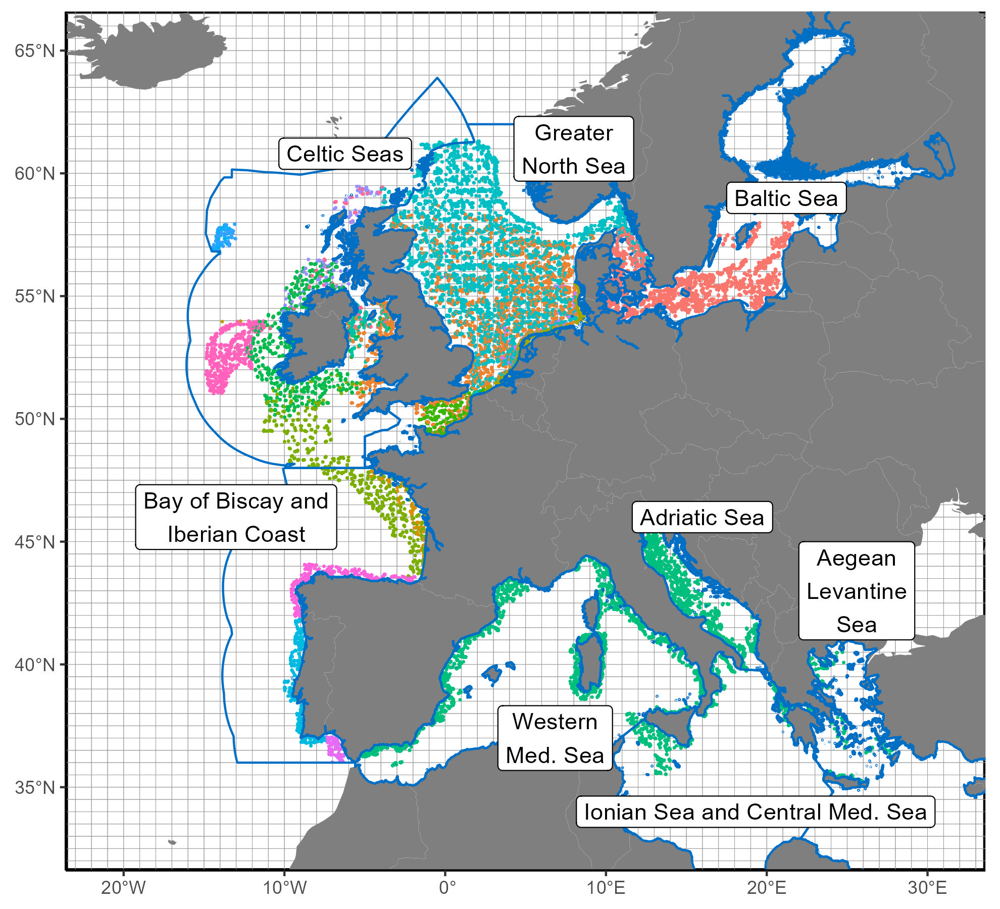
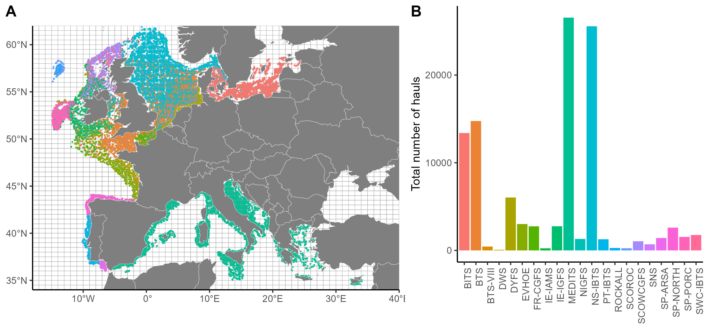

# European demersal fish assemblages

<!-- badges: start -->

<!-- badges: end -->

## Overview

## Data sources

This project uses the following  databases:

| Creator         | Repository                                  | Program                  | Area   | References |
| :-------------- | :------------------------------------------ | :----------------------- | :----: | :----:     |
|                 |                                             |                          |        |            |
|                 |                                             |                          |        |            |
|                 |                                             |                          |        |            |
|                 |                                             |                          |        |            |

## Workflow

The analysis pipeline follows these steps:

1.  Blabla
2.  Blabla
3.  Blabla
4.  Blabla

## Content

This repository is structured as follow:

- [`data/`](https://github.com/auroreRECE/European_demersal_fish_assemblages/tree/main/data):
  contains a sampled of data used in the article. The folder is split in
  two folders:
  [`data/raw/`](https://github.com/auroreRECE/European_demersal_fish_assemblages/main/data/raw)
  to find a sample of all raw data (acoustic, eddy trajectories, chloro
  and sst) ; and
  [`data/intermediate/`](https://github.com/auroreRECE/European_demersal_fish_assemblages/tree/main/data/intermediate)
  with some intermediate .Rdata files, to make easily the Figures.

- [`figures/`](https://github.com/auroreRECE/European_demersal_fish_assemblages/tree/main/figures):
  contains the figures used to validate et visualize the outputs.

- [`scripts/`](https://github.com/auroreRECE/European_demersal_fish_assemblages/tree/main/scripts):
  contains R scripts to run the workflow. The order to run these scripts
  is explained in each name of files and follow the Workflow
  description.

## Citation

Please use the following citation:

> Receveur, A., Leprieur F., Ellingsen K., Keith D., Kleisner K., McLean M., Mérigot B., Mills K., Mouillot D., Rufino M., Trindade-Santos I., Van Hoey G., Albouy C., Auber A.. (2024) Code for “Long-term changes in taxonomic and functional composition of European marine fish communities.” URL:
> <https://github.com/auroreRECE/European_demersal_fish_assemblages>.

## Contributing

All types of contributions are encouraged and valued. 

## Acknowledgments

Aurore Receveur is part of the MAESTRO group co-funded by the Centre for the Synthesis and Analysis of Biodiversity (CESAB) of the Foundation for Research on Biodiversity (FRB), and by France Filière Pêche. 

