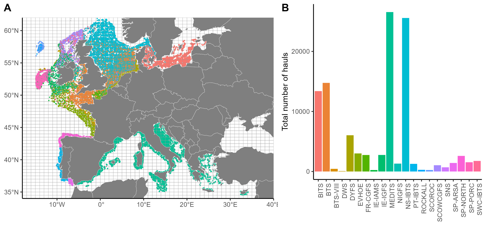

# European demersal fish assemblages

<!-- badges: start -->

<!-- badges: end -->

## Overview

This project is dedicated to study the influence of environnemental
conditions and fishing on the functional and taxonomic structure of
demersal fish community in Europe. This GitHub repository provides the
code of the Receveur et al. (2024) publication in Ecography.

## Data sources

This project uses the following surveys:

| Survey Code | Survey name                                            | Area                                   |  Period   | References |
|:------------|:-------------------------------------------------------|:---------------------------------------|:---------:|:----------:|
| BITS        | Baltic International Trawl Survey                      | Baltic Sea                             | 1994-2019 |     4      |
| BTS         | Beam Trawl Survey                                      | Celtic Sea; English Channel; North Sea | 1997-2019 |     7      |
| BTS-VIII    | Beam Trawl Survey – Bay of Biscay                      | Bay of Biscay                          | 2011-2019 |     7      |
| DWS         | Deepwater Survey                                       | Irish Sea                              | 2006-2007 |     8      |
| DYFS        | Inshore Beam Trawl Survey                              | Southern North Sea                     | 2002-2019 |     7      |
| EVHOE       | French Southern Atlantic Bottom trawl Survey           | Bay of Biscay and Celtic Sea           | 2003-2019 |     1      |
| FR-CGFS     | French Channel ground Survey                           | English Channel                        | 1997-2019 |     2      |
| IE-IAMS     | Irish Anglerfish and megrim Survey                     | Scottish rockall and Irish Sea         | 2016-2019 |     2      |
| IE-IGFS     | Irish Groundfish                                       | Ireland Shelf Sea                      | 2003-2019 |     2      |
| MEDITS      | International bottom trawl survey in the Mediterranean | Mediterranean Sea                      | 1994-2018 |     9      |
| NIGFS       | Northern Ireland Groundfish Survey                     | Irish Sea                              | 2009-2019 |     2      |
| NS-IBTS     | North Sea International Bottom Trawl Survey            | North Sea                              | 1997-2019 |     2      |
| PT-IBTS     | Portuguese International Bottom Trawl Survey           | Portugal Shelf Sea                     | 2003-2017 |     2      |
| ROCKALL     | Scottish Rockall Survey (until 2010)                   | Rockall plateau                        | 2003-2009 |     2      |
| SCOROC      | Scottish Rockall Survey (from 2011)                    | Scottish plateau                       | 2011-2019 |     2      |
| SCOWCGFS    | Scottish West Coast Groundfish Survey                  | Scottish west coast                    | 2011-2019 |     2      |
| SNS         | Sole Net Survey                                        | Southern North Sea                     | 2002-2019 |     7      |
| SP-ARSA     | Spanish Gulf of Cadiz Bottom Trawl Survey              | Spain                                  | 2003-2019 |     6      |
| SP-NORTH    | Spanish North Bottom Trawl Survey                      | North of Spain                         | 2003-2019 |     2      |
| SP-PORC     | Spanish Porcupine Bottom Trawl Survey                  | Irish Sea                              | 2003-2019 |     5      |
| SWC-IBTS    | Scottish West Coast International Bottom Trawl Survey  | Scotland Shelf Sea                     | 1999-2010 |     2      |

## Workflow

The analysis pipeline follows these steps:

1.  Compute the dimension reduction of the taxonomic and functional
    structure
2.  Make and Export the Figures 1 and 2
3.  Test the significant of the temporal trends
4.  Make and Export the Figure 3
5.  Test the influence of environnemental conditions
6.  Make and Export the Figure 4

## Content

This repository is structured as follow:

- [`data/`](https://github.com/auroreRECE/European_demersal_fish_assemblages/tree/main/data):
  contains the data used in the article. The folder is split in three
  folders:
  [`data/ICES_ecoregions/`](https://github.com/auroreRECE/European_demersal_fish_assemblages/tree/main/data/ICES_ecoregions)
  to download the ICES regions shapefile ;
  [`data/raw/`](https://github.com/auroreRECE/European_demersal_fish_assemblages/tree/main/data/raw)
  with the raw MFA and PCA values ;
  [`data/intermediate/`](https://github.com/auroreRECE/European_demersal_fish_assemblages/tree/main/data/intermediate)
  with some intermediate .Rdata and .csv files, to make easily the
  Figures.

- [`figures/`](https://github.com/auroreRECE/European_demersal_fish_assemblages/tree/main/figures):
  contains the figures used to validate et visualize the outputs.

- [`scripts/`](https://github.com/auroreRECE/European_demersal_fish_assemblages/tree/main/scripts):
  contains R scripts to run the workflow. The order to run these scripts
  is explained in each name of files and follow the Workflow
  description.

## Citation

Please use the following citation:

> Receveur, A., Leprieur F., Ellingsen K., Keith D., Kleisner K., McLean
> M., Mérigot B., Mills K., Mouillot D., Rufino M., Trindade-Santos I.,
> Van Hoey G., Albouy C., Auber A.. (2024) Code for “Long-term changes
> in taxonomic and functional composition of European marine fish
> communities.” URL:
> <https://github.com/auroreRECE/European_demersal_fish_assemblages>.

## Contributing

All types of contributions are encouraged and valued.

## Acknowledgments

This research is a product of the MAESTRO group funded by the synthesis
center CESAB of the French Foundation for Research on Biodiversity (FRB;
www.fondationbiodiversite.fr). We thank France Filière Pêche (FFP) who
found the MAESTRO project. We also warmly thank all those who have
contributed in any way to the scientific surveys and data
collection/provision (European Institutions and scientists implicated in
DATRAS-BTS, MEDITS and DCF).

## Data availability

- Biological data: trawls content are publicly available for the North
  East Atlantic (DATRAS database;
  <https://www.ices.dk/data/data-portals/Pages/DATRAS.aspx>).
  Mediterranean data (MEDITS database) are available upon request to
  Maritime Affairs and Fisheries (MARE DATACOLLECTIONFRAMEWORK :
  <https://dcf.ec.europa.eu/guidelines_en>).

- Trait data: the complete traits data table is available upon request.
  It is a combination of the publicly available PANGAEA database
  (\<<https://doi.pangaea.de/10.1594/PANGAEA.900866>), Fishbase
  information (<https://www.fishbase.se/search.php>), and inference
  based on the FISHLIFE project
  (<https://esajournals.onlinelibrary.wiley.com/doi/10.1002/eap.1606>).

- Environmental variables: the data used are all publicly available on
  Copernicus website (<https://data.marine.copernicus.eu/products>).

- Fishing data: the data used are all publicly available on the global
  fishing watch website
  (<https://globalfishingwatch.org/datasets-and-code/>).

## References

1.   ICES. The EVHOE survey (France). ICES Documents. (1997). Available at: <https://archimer.ifremer.fr/doc/00036/14707/12013.pdf>

2.   ICES. Manual of the IBTS North Eastern Atlantic Surveys. Series of ICES Survey Protocols SISP 15 (2017). doi:10.17895/ices.pub.3519

3.   ICES. Manual for the International Bottom Trawl Surveys Revision VIII. Series of ICES Survey Protocols SISP 10 - IBTS IX. (2015).

4.   <https://ices-library.figshare.com/articles/report/SISP_7_-_Manual_for_the_Baltic_International_Trawl_Surveys_BITS_/19050986>

5.   <https://gis.ices.dk/geonetwork/srv/api/records/ce94a257-c8b3-44f7-9fd0-6bd7449ce073>

6.   <http://ices.dk/sites/pub/CM%20Doccuments/2002/D/D0302A.pdf>

7.   <https://ices-library.figshare.com/articles/report/SISP_14_-_Manual_for_the_Offshore_Beam_Trawl_Surveys_WGBEAM_/19051328>

8.   <https://gis.ices.dk/geonetwork/srv/api/records/936b4fb7-9baa-4dbc-abd0-b1b7bda16406>

9.   <https://archimer.ifremer.fr/doc/00117/22783/20585.pdf>
